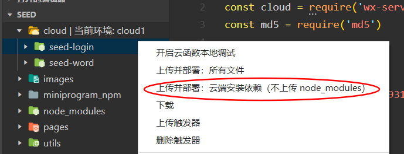
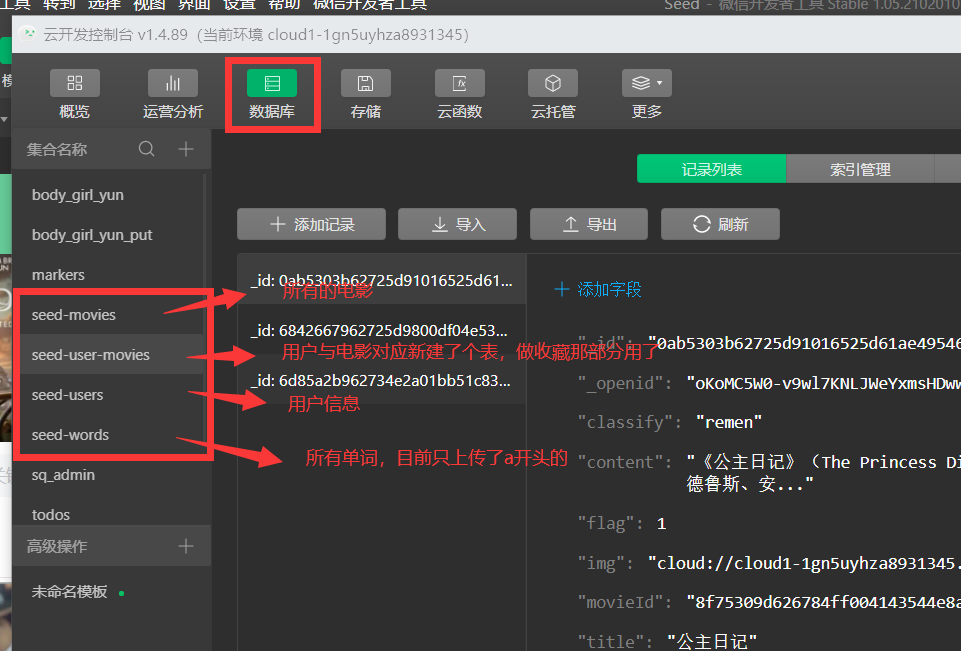
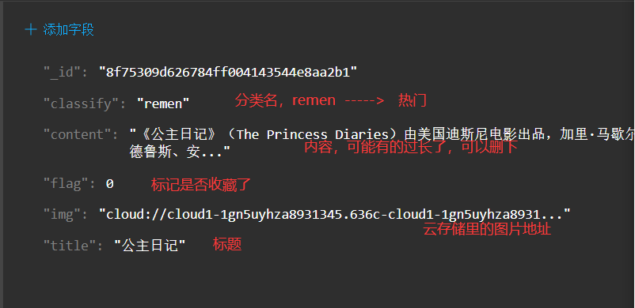
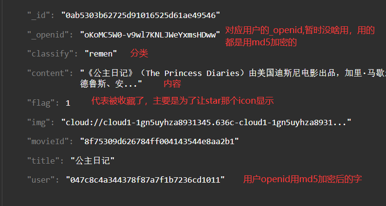
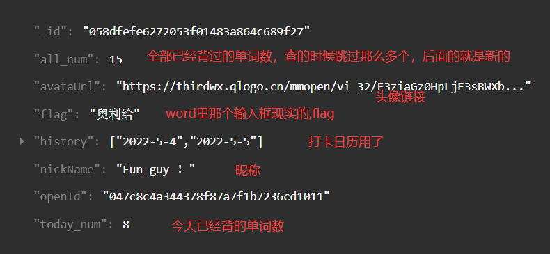
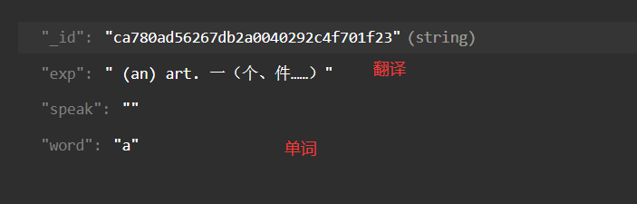
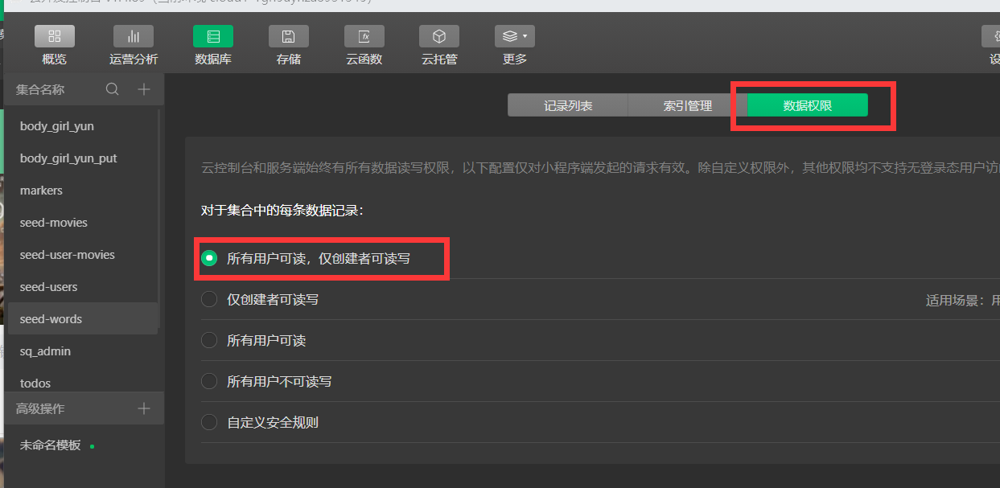
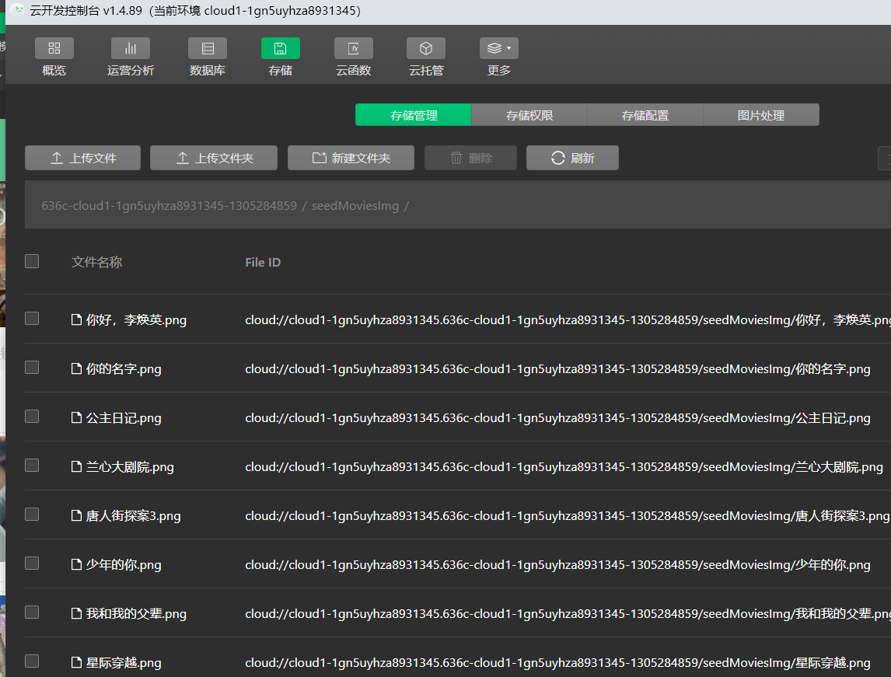
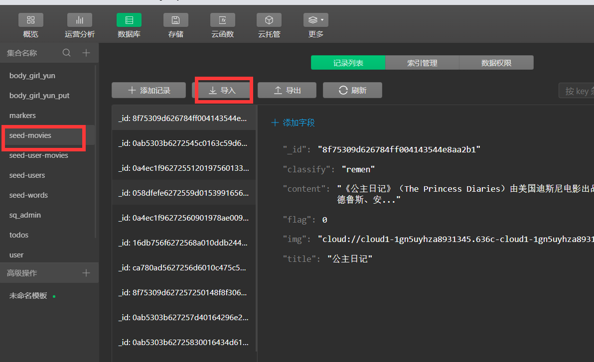
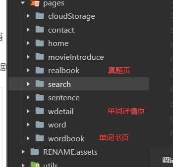

# Seed
UI框架：ant-design
## 项目目录
pages：
app.json：项目配置文件
## home
海报：轮播图的效果进行近期的电影推荐
搜索框：通过输入电影名称的关键字实现对电影的搜索
  解决办法：
     将数据存储在数据库中，用**模糊搜索**的方法搜索数据库中的内容
tab:选项卡组件，用于在不同的内容区域之间进行切换
电影内容：点击之后，会有详细介绍

## sentence

#### wdetail： 单词详情页

### 注意数据权限， 注意修改app.js里的云开发环境ID

## 运行：

1. 修改app.js里云开发环境ID

2. 修改两个云函数seed-login与seed-word下index.js的云函数env

3. 可能也需要上传并部署

   

4. 新建表

   

5. seed-movies表各个字段

   

6. seed-user-movies表各个字段

   

7. seed-users表各个字段

   

8. seed-words表各个字段

   

9. 也可能需要修改下，各个表的数据权限

   

10. 要在存储里面上传各个图片，File ID对应在seed-movies的img字段

    

11. 导入电影数据与单词数据，data文件夹下

    

12. 四六级真题的pdf也要上传进存储里，文件在data文件夹下，上传完成后修改realbook文件夹下realbook.js里的数据的cloudId

13. 
